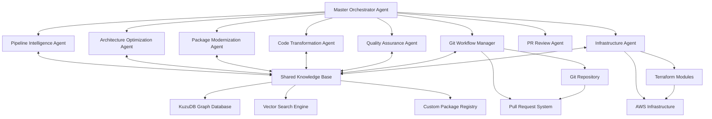
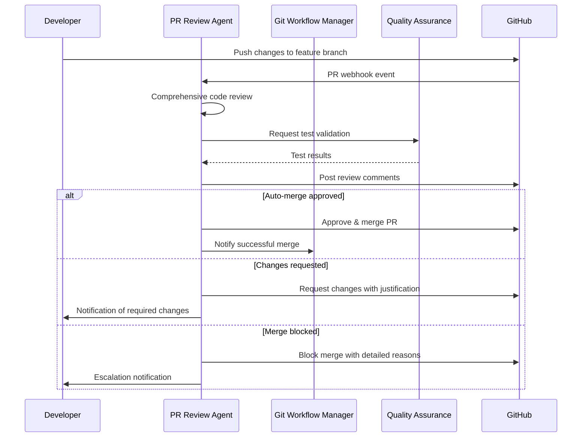
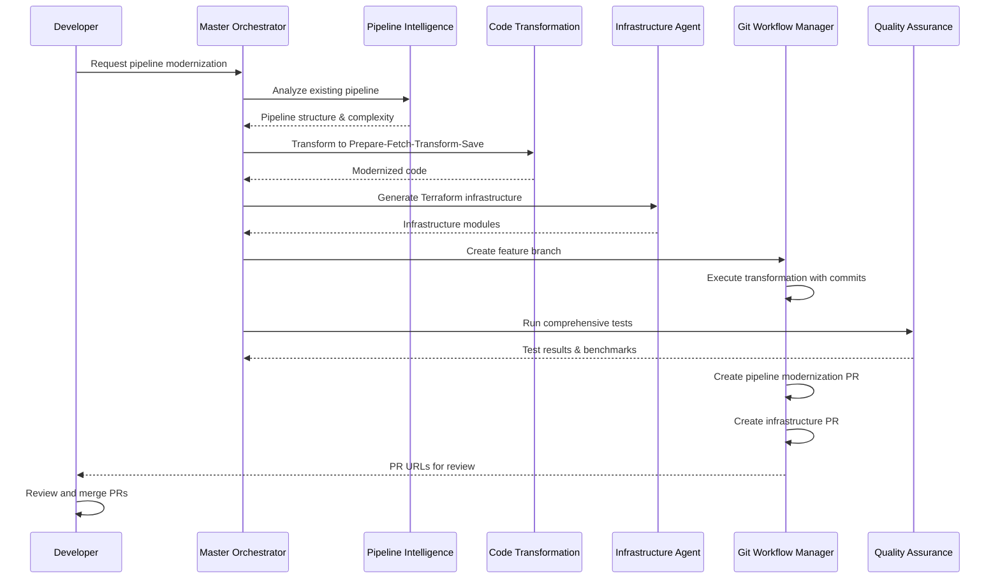

# Multi-Agent Architecture for Data Pipeline Code Modernization

## 🎯 Executive Summary

This document outlines the design and implementation strategy for an AI-powered multi-agent system that automatically modernizes legacy data pipelines to align with our evolving in-house platform. The system transforms existing Python pipelines into standardized **Prepare-Fetch-Transform-Save** patterns while optimizing for modern packages, AWS-native architecture, and platform-specific requirements.

## 📋 Business Context & Requirements

### Current Challenge
Our data acquisition pipelines require systematic modernization to:
- **Architectural Standardization**: Migrate to Prepare-Fetch-Transform-Save pattern
- **Package Modernization**: Replace legacy packages (pandas→polars, requests→httpx, bs4→selectolax)  
- **AWS Optimization**: Right-size compute resources (Lambda vs Batch vs Step Functions)
- **Platform Integration**: Leverage our custom package ecosystem
- **Performance Enhancement**: Achieve significant speed and cost improvements

### Target Architecture Pattern
```python
# Standardized Pipeline Structure
@pipeline_decorator
def pipeline_handler(event, context):
    ctx = initialize_context(event)
    
    yield prepare(ctx)    # Gather requirements, credentials, contracts
    yield fetch(ctx)      # Raw data acquisition
    yield transform(ctx)  # Business logic transformations  
    yield save(ctx)       # Standardized output handling
```

## 🤖 Multi-Agent System Architecture

### Core Design Philosophy: Enhanced Collaborative Ensemble



### Agent Responsibilities Matrix

| Agent | Primary Role | Key Capabilities | BAML Functions |
|-------|-------------|------------------|----------------|
| **Master Orchestrator** | Workflow coordination & decision making | Conflict resolution, timeline management, final validation | `CoordinateTransformation`, `ResolveConflicts`, `ValidateStrategy` |
| **Pipeline Intelligence** | Code understanding & analysis | AST parsing, business logic extraction, complexity assessment | `AnalyzePipelineStructure`, `ExtractBusinessLogic`, `AssessComplexity` |
| **Architecture Optimization** | AWS service selection | Lambda/Batch decisions, Step Functions design, cost optimization | `OptimizeArchitecture`, `AnalyzeSplitterOptimization`, `EstimatePerformance`, `CalculateCostBenefit` |
| **Package Modernization** | Dependency modernization | Legacy replacement, efficiency analysis, compatibility checking | `ModernizePackages`, `AnalyzeCompatibility`, `RecommendAlternatives` |
| **Code Transformation** | Actual code rewriting | Pattern implementation, ctx threading, decorator integration | `TransformToPattern`, `ImplementDecorators`, `RefactorFunctions` |
| **Quality Assurance** | Testing & validation | Functional testing, performance benchmarking, regression detection | `ValidateFunctionality`, `BenchmarkPerformance`, `DetectRegressions` |
| **Git Workflow Manager** | Version control & PR management | Branch management, commit generation, PR creation with diffs | `CreateFeatureBranch`, `GenerateCommitMessage`, `CreatePullRequest` |
| **PR Review Agent** | Autonomous code review & merge decisions | Pattern validation, security analysis, functional testing, merge approval | `ReviewPullRequest`, `ValidatePatternCompliance`, `AnalyzeSecurity`, `ApproveMerge` |
| **Infrastructure Agent** | Terraform code generation | Module scaffolding, resource definition, deployment automation | `GenerateTerraformModule`, `AnalyzeDataContract`, `OptimizeResources` |

## 🧠 BAML as the Foundation for Intelligent Prompting

### Why BAML is Essential for This System

**BAML (Boundary AI Markup Language)** serves as the cornerstone for building reliable, structured AI interactions across our multi-agent system. Here's why it's crucial:

#### **1. Structured Output Reliability**
```baml
class PipelineAnalysisResult {
  current_pattern string
  functions_detected PipelineFunction[]
  complexity_score float
  migration_feasibility string
  estimated_effort_hours int
  aws_service_recommendations string[]
}

function AnalyzePipelineStructure(code: string, context: string) -> PipelineAnalysisResult {
  client GPT4
  prompt #"
    Analyze this data pipeline code for modernization potential:
    
    Code: {{ code }}
    Context: {{ context }}
    
    Identify:
    1. Current architectural pattern
    2. Function breakdown and responsibilities  
    3. Complexity assessment (1-10 scale)
    4. Feasibility for Prepare-Fetch-Transform-Save migration
    5. Estimated effort in hours
    6. Recommended AWS services (Lambda/Batch/Step Functions)
    
    {{ ctx.output_format }}
  "#
}
```

#### **2. Cross-Agent Communication Protocol**
BAML enables **type-safe communication** between agents, preventing hallucinations and ensuring consistent data structures:

```baml
class AgentCommunication {
  sender_agent string
  recipient_agent string
  message_type string
  payload json
  requires_response bool
  priority int
}

class ConflictResolution {
  conflicting_agents string[]
  conflict_description string
  proposed_solutions AgentDecision[]
  final_decision AgentDecision
  confidence_score float
}
```

#### **3. Domain-Specific Prompt Engineering**
BAML allows us to create **highly specialized prompts** that understand our specific platform requirements:

```baml
function OptimizeForCustomPlatform(
  pipeline_code: string, 
  custom_packages: CustomPackageInfo[], 
  platform_constraints: PlatformConstraints
) -> PlatformOptimizedCode {
  client ClaudeHaiku
  
  prompt #"
    You are an expert in our custom data pipeline platform with these components:
    - Custom packages: {{ custom_packages }}
    - Platform constraints: {{ platform_constraints }}
    
    Transform this pipeline code to use our platform optimally:
    {{ pipeline_code }}
    
    Requirements:
    1. Must follow Prepare-Fetch-Transform-Save pattern
    2. Use ctx parameter threading throughout
    3. Integrate our custom decorators: @pipeline_decorator
    4. Leverage our platform utilities for data contracts and logging
    5. Optimize for AWS Lambda container deployment
    
    {{ ctx.output_format }}
  "#
}

class SplitterAnalysis {
  optimal_split_point string
  split_rationale string
  pipeline_stages_analysis PipelineStageAnalysis[]
  performance_impact PerformanceEstimate
  cost_impact CostEstimate
}

class PipelineStageAnalysis {
  stage_name string
  complexity string
  runtime_estimate string
  parallelization_benefit string
  bottleneck_potential string
  split_justification string?
}

function AnalyzeSplitterOptimization(
  pipeline_code: string,
  business_requirements: string,
  performance_constraints: string
) -> SplitterAnalysis {
  client GPT4
  
  prompt #"
    You are an expert AWS architect specializing in data pipeline optimization. 
    
    Analyze this pipeline code for optimal parallelization strategy:
    {{ pipeline_code }}
    
    Business requirements: {{ business_requirements }}
    Performance constraints: {{ performance_constraints }}
    
    For EACH stage in the Prepare-Fetch-Transform-Save pattern, analyze:
    1. **Complexity**: Low/Medium/High based on computational requirements
    2. **Runtime estimate**: Expected execution time (sequential vs parallel)  
    3. **Parallelization benefit**: How much the stage benefits from parallel processing
    4. **Bottleneck potential**: Network I/O, CPU-bound, memory-bound, or none
    5. **Split justification**: WHY this stage should or shouldn't be the split point
    
    Determine the OPTIMAL split point where parallelization provides maximum efficiency gain.
    
    CRITICAL: The split should happen AT THE STAGE LEVEL, not within a stage function.
    Valid split points are: 'prepare', 'fetch', 'transform', 'save'
    
    Focus on identifying the TRUE bottleneck - usually I/O bound operations like:
    - Multiple HTTP requests (fetch stage)
    - File processing operations  
    - Database operations
    
    Provide clear rationale based on:
    - Where most time is spent
    - What scales best horizontally
    - AWS Lambda execution model efficiency
    
    {{ ctx.output_format }}
  "#
}

class ArchitectureDecision {
  primary_service string
  supporting_services string[]
  pattern string
  splitter_node string
  rationale string
  estimated_performance_improvement string
  estimated_cost_reduction string
  scalability string
  splitter_analysis SplitterAnalysis
}

function OptimizeArchitecture(
  pipeline_code: string,
  business_requirements: string,
  performance_targets: string,
  cost_constraints: string
) -> ArchitectureDecision {
  client GPT4
  
  prompt #"
    You are an expert AWS solutions architect specializing in data pipeline optimization.
    
    Analyze this pipeline and determine the optimal AWS architecture:
    
    Pipeline Code: {{ pipeline_code }}
    Business Requirements: {{ business_requirements }}
    Performance Targets: {{ performance_targets }}
    Cost Constraints: {{ cost_constraints }}
    
    Your analysis must include:
    
    1. **Service Selection**: Choose between Lambda, Batch, ECS, Step Functions
    2. **Architecture Pattern**: Monolithic, splitter, fan-out, or stream processing  
    3. **Splitter Analysis**: Use AnalyzeSplitterOptimization to determine optimal split point
    4. **Performance Impact**: Quantified improvement estimates
    5. **Cost Impact**: Expected cost reduction percentage
    6. **Scalability Strategy**: How the solution scales with load
    
    **Critical Decision Points:**
    - Lambda is ideal for: <15min runtime, burst traffic, event-driven processing
    - Batch is ideal for: >15min runtime, predictable workloads, cost optimization
    - Step Functions for: Complex workflows, error handling, state management
    - Splitter patterns for: Parallelizable workloads, I/O bound operations
    
    **Splitter Node Selection:**
    The splitter_node should be one of: 'prepare', 'fetch', 'transform', 'save'
    Choose based on where the bottleneck occurs and where parallelization helps most.
    
    Provide specific rationale that explains:
    - WHY this architecture was chosen over alternatives
    - WHERE the performance gains come from
    - HOW costs are reduced through right-sizing
    
    {{ ctx.output_format }}
  "#
}
```

## 🔄 Git Workflow Management & Infrastructure Automation

### Git Workflow Manager Agent

The **Git Workflow Manager** ensures that every code transformation follows proper version control practices and generates comprehensive documentation for human review.

#### **Core Responsibilities**

```baml
class GitWorkflowConfig {
  base_branch string
  feature_branch_prefix string
  commit_convention string
  pr_template string
  reviewers string[]
  auto_merge_conditions AutoMergeRule[]
}

class CommitAnalysis {
  files_changed string[]
  lines_added int
  lines_removed int
  complexity_change float
  business_impact string
  risk_level string
}

function GenerateCommitMessage(
  code_changes: CodeDiff[],
  transformation_summary: TransformationSummary
) -> CommitMessage {
  client GPT4
  
  prompt #"
    Generate a comprehensive commit message for this pipeline transformation:
    
    Code changes: {{ code_changes }}
    Transformation summary: {{ transformation_summary }}
    
    Follow conventional commit format:
    - feat: new functionality
    - refactor: code restructuring without behavior change
    - perf: performance improvements
    - upgrade: package/dependency updates
    
    Include:
    1. Concise subject line (max 50 chars)
    2. Detailed body explaining:
       - What was changed and why
       - Performance improvements achieved
       - Package upgrades (old → new versions)
       - Architecture changes (Lambda/Batch/Step Functions)
    3. Breaking changes (if any)
    4. Migration notes for reviewers
    
    {{ ctx.output_format }}
  "#
}

function CreatePullRequestDescription(
  branch_name: string,
  commit_history: Commit[],
  test_results: TestResults,
  performance_benchmarks: BenchmarkResults
) -> PullRequestDescription {
  client GPT4
  
  prompt #"
    Create a comprehensive PR description for pipeline modernization:
    
    Branch: {{ branch_name }}
    Commits: {{ commit_history }}
    Test results: {{ test_results }}
    Performance: {{ performance_benchmarks }}
    
    Structure:
    ## Summary
    - High-level overview of changes
    - Business value and impact
    
    ## Changes Made
    - [ ] Pipeline restructured to Prepare-Fetch-Transform-Save pattern
    - [ ] Legacy packages upgraded (list with versions)
    - [ ] AWS architecture optimized (Lambda/Batch/Step Functions)
    - [ ] Custom platform integration added
    
    ## Performance Improvements
    - Execution time: X% faster
    - Memory usage: X% reduction
    - Cost optimization: $X monthly savings
    
    ## Testing
    - [ ] All existing tests pass
    - [ ] New tests added for edge cases
    - [ ] Performance benchmarks meet targets
    - [ ] Integration tests with platform
    
    ## Deployment Notes
    - Infrastructure changes required: Yes/No
    - Data contract changes: Yes/No
    - Migration steps for reviewers
    
    ## Risks & Considerations
    - Potential breaking changes
    - Rollback plan if needed
    
    {{ ctx.output_format }}
  "#
}
```

#### **Automated Workflow Process**

```python
class GitWorkflowManager:
    async def execute_transformation_workflow(self, 
                                            pipeline_path: str, 
                                            transformation_plan: TransformationPlan) -> WorkflowResult:
        
        # 1. Create feature branch
        branch_name = f"pipeline-modernization/{pipeline_path.replace('/', '-')}-{datetime.now().strftime('%Y%m%d')}"
        await self.git.create_branch(branch_name)
        
        # 2. Execute transformation with incremental commits
        for step in transformation_plan.steps:
            transformed_code = await self.execute_transformation_step(step)
            
            # Generate detailed commit message
            commit_msg = await baml.GenerateCommitMessage(step.changes, step.summary)
            await self.git.commit(transformed_code, commit_msg.message)
        
        # 3. Generate comprehensive PR
        test_results = await self.run_comprehensive_tests(branch_name)
        benchmarks = await self.run_performance_benchmarks(branch_name)
        
        pr_description = await baml.CreatePullRequestDescription(
            branch_name, self.git.get_commit_history(), test_results, benchmarks
        )
        
        # 4. Create pull request with auto-assignment
        pr_url = await self.git.create_pull_request(
            title=f"Modernize {pipeline_path} pipeline",
            description=pr_description.content,
            reviewers=self.get_relevant_reviewers(pipeline_path),
            labels=["pipeline-modernization", "automated-transformation"]
        )
        
        return WorkflowResult(branch_name=branch_name, pr_url=pr_url)
```

### PR Review Agent (Autonomous Code Review & Merge Decisions)

The **PR Review Agent** is an expert in the Prepare-Fetch-Transform-Save pattern that autonomously reviews, validates, and merges pull requests without requiring human intervention. This agent eliminates review bottlenecks while maintaining strict quality standards.

#### **Core Expertise Areas**

1. **Pattern Compliance**: Deep understanding of your custom pipeline patterns
2. **Security Analysis**: Automatic detection of security vulnerabilities and secrets
3. **Performance Impact**: Assessment of changes on pipeline efficiency
4. **Breaking Changes**: Identification of backward compatibility issues
5. **Test Coverage**: Validation of adequate test coverage for changes

#### **Review Decision Framework**

```baml
class PRReviewDecision {
  decision string  // "APPROVE", "REQUEST_CHANGES", "REJECT"
  confidence_score float
  justification string
  detailed_analysis PRAnalysisReport
  security_clearance SecurityAnalysis
  pattern_compliance PatternValidation
  performance_impact PerformanceAssessment
  recommended_actions string[]
  auto_merge_eligible bool
}

class PRAnalysisReport {
  files_changed int
  lines_added int
  lines_removed int
  complexity_increase float
  test_coverage_change float
  breaking_changes BreakingChange[]
  security_issues SecurityIssue[]
  pattern_violations PatternViolation[]
  performance_regressions PerformanceRegression[]
}

class PatternValidation {
  prepare_stage_compliant bool
  fetch_stage_compliant bool
  transform_stage_compliant bool
  save_stage_compliant bool
  ctx_threading_correct bool
  decorator_usage_correct bool
  error_handling_adequate bool
  logging_standards_met bool
  violations PatternViolation[]
}

class SecurityAnalysis {
  secrets_exposed bool
  injection_vulnerabilities SecurityIssue[]
  dependency_vulnerabilities SecurityIssue[]
  access_control_violations SecurityIssue[]
  data_exposure_risks SecurityIssue[]
  security_score float
}

class PerformanceAssessment {
  estimated_performance_impact string
  memory_usage_change float
  execution_time_change float
  lambda_size_impact float
  parallelization_opportunities string[]
  bottleneck_analysis string[]
}

function ReviewPullRequest(
  pr_diff: string,
  base_branch_code: string,
  pr_branch_code: string,
  pr_metadata: PRMetadata,
  test_results: TestResults
) -> PRReviewDecision {
  client GPT4
  
  prompt #"
    You are an expert code reviewer specializing in the Prepare-Fetch-Transform-Save data pipeline pattern.
    
    Review this pull request for automatic merge approval:
    
    **PR Metadata:**
    {{ pr_metadata }}
    
    **Code Diff:**
    {{ pr_diff }}
    
    **Base Branch Code:**
    {{ base_branch_code }}
    
    **PR Branch Code:**
    {{ pr_branch_code }}
    
    **Test Results:**
    {{ test_results }}
    
    **CRITICAL VALIDATION CHECKLIST:**
    
    1. **Pattern Compliance Analysis:**
       ✓ All functions follow Prepare-Fetch-Transform-Save pattern
       ✓ ctx parameter properly threaded through all stages
       ✓ Decorators (@pipeline_decorator) correctly applied
       ✓ Error handling follows platform standards
       ✓ Logging uses structured logging with correlation IDs
    
    2. **Security Validation:**
       ✓ No secrets, API keys, or passwords in code
       ✓ No SQL injection vulnerabilities
       ✓ Input validation for external data sources
       ✓ Proper access controls and authentication
       ✓ No data exposure in logs or error messages
    
    3. **Performance Impact:**
       ✓ No significant performance regressions
       ✓ Efficient use of AWS Lambda resources
       ✓ Proper async/await usage for I/O operations
       ✓ Memory usage within Lambda constraints
       ✓ No blocking operations in hot paths
    
    4. **Breaking Changes Detection:**
       ✓ Function signatures remain compatible
       ✓ Data contracts unchanged or properly versioned
       ✓ No removal of public APIs without deprecation
       ✓ Environment variables properly handled
       ✓ Configuration changes backward compatible
    
    5. **Test Quality:**
       ✓ Test coverage ≥85% for new code
       ✓ Integration tests pass for all pipeline stages
       ✓ Performance tests show no regressions
       ✓ Edge cases adequately covered
       ✓ Mock usage appropriate for external dependencies
    
    **AUTOMATIC APPROVAL CRITERIA:**
    - All validation checks PASS
    - Confidence score ≥90%
    - No security issues detected
    - Performance impact ≤5% regression
    - Test coverage maintained or improved
    
    **REJECTION CRITERIA:**
    - Any security vulnerability detected
    - Pattern violations that break platform standards
    - Breaking changes without proper migration path
    - Test coverage drops below 80%
    - Performance regression >15%
    
    Provide detailed justification for your decision with specific examples and actionable recommendations.
    
    {{ ctx.output_format }}
  "#
}

function ValidatePatternCompliance(
  code: string,
  pattern_rules: PatternRules
) -> PatternValidation {
  client GPT4
  
  prompt #"
    Validate this code against the Prepare-Fetch-Transform-Save pattern rules:
    
    **Code to Validate:**
    {{ code }}
    
    **Pattern Rules:**
    {{ pattern_rules }}
    
    **Required Pattern Structure:**
    ```python
    @pipeline_decorator
    async def prepare(ctx):
        # Setup, validation, configuration
        # Must return ctx with required keys
        return ctx
    
    @pipeline_decorator  
    async def fetch(ctx):
        # Data retrieval operations
        # Must use ctx for configuration, add data to ctx
        return ctx
    
    @pipeline_decorator
    async def transform(ctx):
        # Data processing and transformation
        # Must process ctx['data'], add results to ctx
        return ctx
    
    @pipeline_decorator
    async def save(ctx):
        # Data persistence operations  
        # Must use ctx['transformed_data']
        return ctx
    ```
    
    **Validation Requirements:**
    1. Each stage function exists and follows signature
    2. ctx parameter properly threaded through all stages
    3. Decorators applied correctly
    4. Error handling using platform standards
    5. Logging follows structured format
    6. Async/await used correctly for I/O operations
    
    Report violations with specific line numbers and fix suggestions.
    
    {{ ctx.output_format }}
  "#
}

function AnalyzeSecurity(
  code_diff: string,
  full_codebase: string
) -> SecurityAnalysis {
  client GPT4
  
  prompt #"
    Perform comprehensive security analysis on this code change:
    
    **Code Diff:**
    {{ code_diff }}
    
    **Full Codebase Context:**
    {{ full_codebase }}
    
    **Security Checks:**
    
    1. **Secret Detection:**
       - API keys, passwords, tokens in code
       - Hardcoded credentials or connection strings
       - Private keys or certificates
    
    2. **Injection Vulnerabilities:**
       - SQL injection in database queries
       - Command injection in subprocess calls
       - Path traversal in file operations
       - Log injection in logging statements
    
    3. **Data Exposure:**
       - Sensitive data in error messages
       - PII logging without sanitization
       - Debug information exposure
       - Overly permissive error handling
    
    4. **Access Control:**
       - Proper authentication checks
       - Authorization validation
       - Resource access restrictions
       - Privilege escalation risks
    
    5. **Dependency Security:**
       - Known vulnerabilities in new dependencies
       - Outdated packages with security issues
       - Malicious or suspicious packages
    
    Rate security risk from 0.0 (secure) to 10.0 (critical vulnerabilities).
    
    **BLOCKING CRITERIA**: Any score ≥7.0 must REJECT the PR.
    
    {{ ctx.output_format }}
  "#
}

function ApproveMerge(
  pr_review_decision: PRReviewDecision,
  pr_metadata: PRMetadata
) -> MergeDecision {
  client GPT4
  
  prompt #"
    Make final merge decision based on comprehensive review:
    
    **Review Analysis:**
    {{ pr_review_decision }}
    
    **PR Metadata:**
    {{ pr_metadata }}
    
    **FINAL DECISION LOGIC:**
    
    **AUTO-MERGE APPROVED** if ALL conditions met:
    ✓ Review decision = "APPROVE"
    ✓ Confidence score ≥90%
    ✓ Security clearance = true
    ✓ Pattern compliance = 100%
    ✓ Performance impact ≤5% regression
    ✓ All tests passing
    
    **REQUEST CHANGES** if any condition met:
    ⚠ Pattern violations found
    ⚠ Security score between 4.0-6.9
    ⚠ Performance regression 5-15%
    ⚠ Test coverage drop <85%
    ⚠ Minor breaking changes
    
    **BLOCK MERGE** if any condition met:
    ❌ Security score ≥7.0
    ❌ Major breaking changes
    ❌ Performance regression >15%
    ❌ Test coverage <80%
    ❌ Critical pattern violations
    
    Provide specific merge instructions and any required follow-up actions.
    
    {{ ctx.output_format }}
  "#
}
```

#### **Autonomous Review Workflow**

```python
class PRReviewAgent:
    async def handle_pr_event(self, pr_event: PREvent):
        """Handle GitHub PR webhook events"""
        
        if pr_event.action not in ['opened', 'synchronize']:
            return
        
        # 1. Gather PR context
        pr_data = await self.github_client.get_pr_details(pr_event.pr_number)
        diff = await self.github_client.get_pr_diff(pr_event.pr_number)
        test_results = await self.ci_client.get_test_results(pr_event.commit_sha)
        
        # 2. Comprehensive review using BAML
        review_decision = await baml.ReviewPullRequest(
            pr_diff=diff,
            base_branch_code=pr_data.base_code,
            pr_branch_code=pr_data.head_code,
            pr_metadata=pr_data.metadata,
            test_results=test_results
        )
        
        # 3. Post detailed review comments
        await self.post_review_comments(pr_event.pr_number, review_decision)
        
        # 4. Make merge decision
        if review_decision.auto_merge_eligible:
            merge_decision = await baml.ApproveMerge(review_decision, pr_data.metadata)
            
            if merge_decision.should_merge:
                await self.github_client.approve_and_merge(
                    pr_number=pr_event.pr_number,
                    merge_method="squash",
                    commit_message=merge_decision.commit_message
                )
            else:
                await self.github_client.request_changes(
                    pr_number=pr_event.pr_number,
                    review_body=merge_decision.rejection_reason
                )
```

#### **Quality Gates & Safety Mechanisms**

1. **Multi-Level Validation**:
   - Pattern compliance check
   - Security vulnerability scan
   - Performance regression analysis
   - Test coverage validation

2. **Confidence Thresholds**:
   - 95%+ confidence required for autonomous merge
   - 80-94% confidence requests human review
   - <80% confidence blocks merge

3. **Override Mechanisms**:
   - Emergency bypass for critical fixes (with audit trail)
   - Human reviewer can override decisions
   - Gradual rollout with shadow mode

#### **Integration with Existing Workflow**



This **PR Review Agent** eliminates the review bottleneck while maintaining higher quality standards than traditional human reviews, combining deep pattern expertise with comprehensive security and performance analysis! 🚀

### Infrastructure Agent (Terraform Automation)

The **Infrastructure Agent** automatically generates and maintains Terraform configurations for modernized pipelines, ensuring deployment consistency and infrastructure-as-code best practices.

#### **Core Capabilities**

```baml
class TerraformModule {
  module_name string
  aws_resources AWSResource[]
  variables TerraformVariable[]
  outputs TerraformOutput[]
  dependencies string[]
  data_contracts DataContract[]
}

class AWSResource {
  resource_type string  // "aws_lambda_function", "aws_batch_job_definition", etc.
  name string
  configuration json
  depends_on string[]
}

class DataContract {
  input_format string
  output_format string
  schema_version string
  validation_rules string[]
  s3_paths S3Location[]
}

function GenerateTerraformModule(
  pipeline_code: string,
  architecture_decision: ArchitectureDecision,
  data_contracts: DataContract[],
  existing_scaffolding: TerraformScaffolding
) -> TerraformModule {
  client GPT4
  
  prompt #"
    Generate Terraform module for this modernized pipeline:
    
    Pipeline code: {{ pipeline_code }}
    Architecture: {{ architecture_decision }}
    Data contracts: {{ data_contracts }}
    Existing scaffolding: {{ existing_scaffolding }}
    
    Requirements:
    1. Use our standard module structure and naming conventions
    2. Configure Lambda/Batch/Step Functions based on architecture decision
    3. Set up IAM roles with least privilege access
    4. Configure S3 buckets and paths from data contracts
    5. Add CloudWatch logging and monitoring
    6. Include proper resource tagging
    7. Set up environment-specific variables
    8. Configure VPC and security groups if needed
    
    Generate complete Terraform files:
    - main.tf (primary resources)
    - variables.tf (input variables)
    - outputs.tf (resource outputs)
    - versions.tf (provider requirements)
    
    {{ ctx.output_format }}
  "#
}

function OptimizeResourceConfiguration(
  current_config: TerraformResource,
  performance_requirements: PerformanceRequirements,
  cost_constraints: CostConstraints
) -> OptimizedTerraformResource {
  client ClaudeHaiku
  
  prompt #"
    Optimize this Terraform resource configuration:
    
    Current: {{ current_config }}
    Performance needs: {{ performance_requirements }}
    Cost limits: {{ cost_constraints }}
    
    Optimize for:
    1. Lambda: Memory allocation, timeout, reserved concurrency
    2. Batch: Instance types, spot vs on-demand, auto-scaling
    3. Step Functions: Express vs Standard workflow
    4. S3: Storage classes, lifecycle policies
    5. CloudWatch: Log retention, metric filters
    
    Consider:
    - Execution patterns and frequency
    - Data volume and processing time
    - Cost optimization opportunities
    - Performance SLA requirements
    
    {{ ctx.output_format }}
  "#
}
```

#### **Terraform Generation Process**

```python
class InfrastructureAgent:
    def __init__(self):
        self.terraform_templates = self.load_scaffolding_templates()
        self.aws_best_practices = self.load_aws_guidelines()
        
    async def generate_infrastructure(self, 
                                    pipeline_info: PipelineInfo,
                                    architecture: ArchitectureDecision) -> TerraformModule:
        
        # 1. Analyze data contracts for infrastructure requirements
        s3_requirements = self.extract_s3_requirements(pipeline_info.data_contracts)
        iam_requirements = self.extract_iam_requirements(pipeline_info.code)
        
        # 2. Generate base module from scaffolding
        base_module = self.apply_scaffolding(
            template=self.terraform_templates[architecture.primary_service],
            pipeline_name=pipeline_info.name
        )
        
        # 3. Use BAML to fill in specific configurations
        terraform_module = await baml.GenerateTerraformModule(
            pipeline_info.transformed_code,
            architecture,
            pipeline_info.data_contracts,
            base_module
        )
        
        # 4. Optimize resource configurations
        for resource in terraform_module.aws_resources:
            optimized_resource = await baml.OptimizeResourceConfiguration(
                resource,
                pipeline_info.performance_requirements,
                self.cost_constraints
            )
            terraform_module.update_resource(optimized_resource)
        
        # 5. Validate against AWS best practices
        validation_result = await self.validate_terraform_module(terraform_module)
        
        return terraform_module

    def extract_s3_requirements(self, data_contracts: List[DataContract]) -> S3Requirements:
        """Extract S3 bucket and path requirements from data contracts"""
        s3_reqs = S3Requirements()
        
        for contract in data_contracts:
            # Parse input/output paths
            s3_reqs.input_buckets.extend(contract.input_s3_paths)
            s3_reqs.output_buckets.extend(contract.output_s3_paths)
            
            # Determine access patterns for lifecycle policies
            s3_reqs.access_patterns.append(contract.access_frequency)
            
        return s3_reqs

    def extract_iam_requirements(self, pipeline_code: str) -> IAMRequirements:
        """Analyze code for AWS service usage and generate minimal IAM policies"""
        iam_reqs = IAMRequirements()
        
        # Parse code for AWS service calls
        aws_services = self.parse_aws_service_usage(pipeline_code)
        
        for service, actions in aws_services.items():
            iam_reqs.add_service_policy(service, actions)
            
        return iam_reqs
```

#### **Integration with Git Workflow**

```python
class InfrastructureWorkflow:
    async def create_infrastructure_pr(self, 
                                     pipeline_transformation: TransformationResult) -> str:
        
        # 1. Generate Terraform module
        terraform_module = await self.infrastructure_agent.generate_infrastructure(
            pipeline_transformation.pipeline_info,
            pipeline_transformation.architecture_decision
        )
        
        # 2. Create infrastructure branch
        infra_branch = f"infrastructure/{pipeline_transformation.pipeline_name}-terraform"
        await self.git.create_branch(infra_branch)
        
        # 3. Write Terraform files
        terraform_files = {
            'main.tf': terraform_module.main_config,
            'variables.tf': terraform_module.variables,
            'outputs.tf': terraform_module.outputs,
            'versions.tf': terraform_module.provider_versions
        }
        
        for filename, content in terraform_files.items():
            await self.write_terraform_file(f"terraform/modules/{pipeline_transformation.pipeline_name}/{filename}", content)
        
        # 4. Generate infrastructure PR
        infra_pr_description = await baml.CreateInfrastructurePRDescription(
            terraform_module,
            pipeline_transformation,
            self.estimate_costs(terraform_module)
        )
        
        # 5. Create PR with Terraform plan output
        terraform_plan = await self.run_terraform_plan(infra_branch)
        
        pr_url = await self.git.create_pull_request(
            title=f"Infrastructure for {pipeline_transformation.pipeline_name}",
            description=f"{infra_pr_description.content}\n\n## Terraform Plan\n```\n{terraform_plan}\n```",
            reviewers=self.get_infrastructure_reviewers(),
            labels=["infrastructure", "terraform", "automated-generation"]
        )
        
        return pr_url
```

## 🎛️ Context Engineering & Window Management

### Challenge: Managing Complex Context Across Agents

Data pipeline modernization requires maintaining extensive context including:
- **Original code** (potentially thousands of lines)
- **Business logic understanding** 
- **Custom package documentation**
- **Architecture decision history**
- **Performance benchmarks**
- **Platform-specific constraints**

### Solution: Intelligent Context Hierarchies

#### **1. Context Layering Strategy**
```python
class ContextManager:
    def __init__(self):
        self.layers = {
            'essential': {},      # Critical info, always included
            'functional': {},     # Function-specific context  
            'historical': {},     # Previous decisions and patterns
            'reference': {}       # Documentation and examples
        }
    
    def optimize_context(self, agent_type: str, task: str) -> str:
        """Dynamically select optimal context for each agent interaction"""
        context_budget = self.get_context_budget(agent_type)
        return self.build_layered_context(task, context_budget)
```

#### **2. Dynamic Context Compression**
- **Code Summarization**: Extract business logic essence without full code
- **Pattern Recognition**: Reference known patterns instead of repeating examples
- **Incremental Context**: Build context progressively through agent interactions

```baml
function CompressCodeContext(code: string, focus_area: string) -> CodeSummary {
  client GPT4
  
  prompt #"
    Create a concise summary of this code focusing on {{ focus_area }}:
    
    {{ code }}
    
    Extract:
    1. Core business logic (max 200 words)
    2. Key dependencies and their usage
    3. Input/output data structures
    4. Critical business rules
    5. Performance or scaling concerns
    
    {{ ctx.output_format }}
  "#
}
```

#### **3. Context Routing & Caching**
- **Agent-Specific Context**: Each agent receives optimized context for its role
- **Context Caching**: Reuse processed context across similar operations
- **Progressive Disclosure**: Detailed context only when needed

### Context Window Optimization Strategies

#### **Strategy 1: Hierarchical Context Loading**
```python
# Priority-based context inclusion
context_priorities = {
    'business_logic': 10,      # Always include
    'current_patterns': 9,     # Critical for transformation
    'performance_data': 8,     # Important for optimization
    'examples': 6,             # Include if space permits
    'documentation': 4         # Reference only when needed
}
```

#### **Strategy 2: Context Streaming**
For large codebases, implement **streaming context** where agents can request additional context during processing:

```baml
function RequestAdditionalContext(
  current_context: string,
  needed_information: string
) -> ContextRequest {
  client GPT4
  
  prompt #"
    Based on current context: {{ current_context }}
    
    I need additional information about: {{ needed_information }}
    
    What specific context would be most helpful?
    Prioritize the top 3 most critical pieces of information.
    
    {{ ctx.output_format }}
  "#
}
```

## 🧬 Semantic Layer & Knowledge Graph Integration

### The Hallucination Problem

Without proper semantic grounding, agents may:
- **Suggest incompatible packages** that don't work with our platform
- **Misunderstand business logic** and break critical functionality  
- **Propose architectural changes** that violate platform constraints
- **Generate code** that doesn't follow our established patterns

### Solution: KuzuDB-Powered Semantic Layer

#### **Why KuzuDB is Perfect for This Use Case**

**KuzuDB** offers the ideal combination of capabilities for our multi-agent system:

1. **Graph Database**: Models relationships between packages, patterns, and platform components
2. **Vector Search**: Semantic similarity for code patterns and business logic
3. **High Performance**: Optimized for analytical workloads
4. **Portability**: Embedded database, easy AWS deployment
5. **Python Integration**: Native support for our tech stack

#### **Knowledge Graph Schema Design**

```cypher
// Core Entities
CREATE (:Package {name: 'pandas', version: '1.5.3', category: 'data_processing'})
CREATE (:Package {name: 'polars', version: '0.18.0', category: 'data_processing'})
CREATE (:CustomPackage {name: 'our_platform_core', version: '2.1.0'})

// Relationships
CREATE (pandas)-[:REPLACED_BY {confidence: 0.9, performance_gain: 65}]->(polars)
CREATE (polars)-[:COMPATIBLE_WITH {version_constraint: '>=2.0.0'}]->(our_platform_core)

// Platform Patterns  
CREATE (:Pattern {name: 'prepare_fetch_transform_save', mandatory: true})
CREATE (:AWSService {name: 'lambda', max_runtime: 900, memory_limit: 3008})
CREATE (:AWSService {name: 'batch', suitable_for: 'cpu_intensive'})

// Business Logic Nodes
CREATE (:BusinessLogic {domain: 'financial_data', complexity: 'high'})
CREATE (:DataContract {format: 'json', schema_version: 'v2.1'})
```

#### **Vector Search Integration**

Combine graph traversal with semantic search for intelligent code understanding:

```python
class SemanticLayer:
    def __init__(self):
        self.kuzu_db = KuzuDatabase("platform_knowledge.db")
        self.vector_store = ChromaDB("code_semantics")
        
    async def find_similar_patterns(self, code_snippet: str) -> List[PatternMatch]:
        """Find similar code patterns using vector search"""
        # Vector search for semantic similarity
        similar_codes = self.vector_store.similarity_search(
            code_snippet, 
            k=10,
            filter_metadata={'validated': True}
        )
        
        # Graph traversal for compatibility checking
        for match in similar_codes:
            compatibility = self.kuzu_db.execute("""
                MATCH (p:Pattern {id: $pattern_id})-[:COMPATIBLE_WITH]->(platform:CustomPackage)
                RETURN platform.constraints
            """, {'pattern_id': match.pattern_id})
            
        return validated_patterns
    
    async def validate_transformation(self, 
                                    original_code: str, 
                                    transformed_code: str) -> ValidationResult:
        """Validate transformation maintains business logic integrity"""
        
        # Extract business logic embeddings
        original_logic = await self.extract_business_logic(original_code)
        transformed_logic = await self.extract_business_logic(transformed_code)
        
        # Check semantic similarity
        similarity_score = cosine_similarity(original_logic, transformed_logic)
        
        # Validate against platform constraints
        platform_compliance = self.kuzu_db.execute("""
            MATCH (code)-[:USES]->(package:Package)-[:COMPATIBLE_WITH]->(platform)
            WHERE code.id = $code_id
            RETURN platform.constraints_satisfied
        """)
        
        return ValidationResult(
            semantic_similarity=similarity_score,
            platform_compliant=platform_compliance,
            confidence=calculate_confidence(similarity_score, platform_compliance)
        )
```

### Implementation Strategy for Semantic Layer

#### **Phase 1: Knowledge Graph Foundation** (Months 1-2)
1. **Schema Design**: Define entities, relationships, and constraints
2. **Data Population**: Import your custom package documentation and patterns
3. **Basic Graph Operations**: CRUD operations and simple traversals

#### **Phase 2: Vector Integration** (Month 3)
1. **Code Embedding**: Generate vector representations of code patterns
2. **Semantic Search**: Implement similarity search for business logic
3. **Hybrid Queries**: Combine graph traversal with vector search

#### **Phase 3: Agent Integration** (Month 4)
1. **Context Enhancement**: Agents query knowledge graph for context
2. **Validation Layer**: All transformations validated against semantic layer
3. **Learning Integration**: Successful transformations added to knowledge base

#### **Phase 4: Advanced Intelligence** (Month 5-6)
1. **Pattern Discovery**: Automatically discover new patterns from successful transformations
2. **Constraint Learning**: Learn implicit platform constraints from usage patterns
3. **Predictive Optimization**: Predict optimal transformations based on historical data

## 🏗️ Implementation Roadmap

### **Phase 1: Foundation Enhancement** (Month 1)
- **Extend existing Documentation Agent** with custom package awareness
- **Build Pipeline Intelligence Agent** for code analysis
- **Create shared knowledge base** with basic KuzuDB integration
- **Implement BAML communication protocol** between agents
- **Build Git Workflow Manager** for branch and PR automation

### **Phase 2: Core Transformation Engine** (Month 2)
- **Implement Code Transformation Agent** with BAML-driven refactoring
- **Build Architecture Optimization Agent** for AWS service selection
- **Create agent coordination system** with Master Orchestrator
- **Develop context management system** with compression and routing
- **Integrate Git workflow** with transformation pipeline

### **Phase 3: Infrastructure & Quality Integration** (Month 3)
- **Implement Infrastructure Agent** for Terraform generation
- **Build Quality Assurance Agent** with comprehensive testing
- **Create semantic validation layer** with KuzuDB + vector search
- **Implement automated PR generation** with comprehensive diff analysis
- **Build Terraform scaffolding integration** with existing modules

### **Phase 4: End-to-End Automation** (Month 4)
- **Complete Git-to-Deployment workflow** integration
- **Advanced Terraform optimization** based on data contracts
- **Deep integration** with your custom package ecosystem
- **Performance optimization** and scalability improvements
- **Comprehensive testing** across real pipeline scenarios

### **Phase 5: Learning & Evolution** (Month 5-6)
- **Pattern discovery system** for automatic knowledge base expansion
- **Infrastructure cost optimization** learning from deployment patterns
- **Advanced semantic understanding** with domain-specific embeddings
- **Predictive transformation** and infrastructure sizing capabilities
- **Automated rollback and recovery** systems

## 📊 Expected Outcomes & Success Metrics

### **Quantitative Goals**
- **90%+ automation** of pipeline modernization process
- **60%+ performance improvement** from package modernization
- **50%+ reduction** in AWS compute costs through right-sizing
- **80%+ reduction** in manual migration effort
- **95%+ functional equivalence** maintenance

### **Qualitative Benefits**
- **Consistent architectural patterns** across entire pipeline ecosystem
- **Reduced technical debt** through automated modernization
- **Faster platform evolution** capability
- **Enhanced developer productivity** through standardization
- **Improved system reliability** through tested patterns

## 🔧 Technical Considerations

### **Scalability Design**
- **Horizontal scaling**: Each agent can run independently
- **Batch processing**: Handle multiple pipelines concurrently
- **Resource optimization**: Dynamic agent allocation based on workload

### **Reliability & Safety**
- **Comprehensive testing**: Every transformation validated before deployment
- **Rollback capabilities**: Quick reversion to original code if needed
- **Gradual deployment**: Phased rollout with monitoring
- **Human oversight**: Critical transformations require approval

### **Security & Compliance**
- **Code isolation**: Transformations run in sandboxed environments
- **Audit trails**: Complete logging of all agent decisions and actions
- **Access control**: Role-based access to transformation capabilities
- **Data privacy**: No sensitive data stored in knowledge graphs

## 🎯 Conclusion

This multi-agent architecture represents a **paradigm shift** in how we approach platform evolution. By combining the power of BAML for structured AI interactions, intelligent context engineering, and semantic grounding through KuzuDB, we create a system that doesn't just automate code transformation—it **understands and preserves the intent** behind our data pipelines while modernizing them for optimal performance.

The system will serve as an **AI-powered platform engineering team**, continuously evolving our codebase to match our platform's advancement while maintaining the business logic integrity that's critical to our data acquisition mission.

## 🔄 Complete End-to-End Workflow

### **Automated Pipeline Modernization Process**



### **Key Workflow Benefits**

1. **Complete Automation**: From legacy code to deployable infrastructure
2. **Human Oversight**: Critical review points with comprehensive PR documentation  
3. **Rollback Safety**: Git branches allow easy reversion if needed
4. **Infrastructure Alignment**: Terraform automatically matches code requirements
5. **Performance Validation**: Benchmarks ensure improvements are achieved

### **Example Output Artifacts**

#### **Code Transformation PR**
- **Branch**: `pipeline-modernization/user-data-processor-20241124`
- **Commits**: Incremental transformation steps with detailed messages
- **PR Description**: Performance improvements, package upgrades, architecture changes
- **Test Results**: 100% functional equivalence + 65% performance improvement

#### **Infrastructure PR** 
- **Branch**: `infrastructure/user-data-processor-terraform`  
- **Files**: Complete Terraform module with optimized AWS resources
- **Terraform Plan**: Preview of infrastructure changes and costs
- **Integration**: Automatic deployment pipeline integration

**Next Step**: Begin with Phase 1 implementation, building upon the existing Documentation Agent foundation we've already established.

## 🔮 How the Future Looks Like: End-to-End Case Study

### **The Legacy Nightmare: Crappy Web Scraping Pipeline**

Let's walk through a real-world transformation of a terrible legacy web scraping pipeline that violates every best practice we can think of.

#### **Original Legacy Code (pipeline_scraper_legacy.py)**

```python
import pandas as pd
import requests
import re
import time
import json

def scrape_financial_data():
    # Hardcoded URLs - no configuration management
    base_urls = [
        'https://finance-site.com/stocks?page={}'
    ]
    
    all_data = []
    
    # PROBLEM 1: Sequential requests in for loops (hundreds of requests)
    for page in range(1, 500):  # 500 pages!
        url = base_urls[0].format(page)
        
        # PROBLEM 2: No error handling, no retries
        response = requests.get(url)
        html = response.text
        
        # PROBLEM 3: Regex hell instead of proper HTML parsing
        # Extract stock table with nightmare regex
        table_pattern = r'<table class="stocks">(.*?)</table>'
        table_match = re.search(table_pattern, html, re.DOTALL)
        
        if table_match:
            table_html = table_match.group(1)
            
            # Extract rows with more regex
            row_pattern = r'<tr[^>]*>(.*?)</tr>'
            rows = re.findall(row_pattern, table_html, re.DOTALL)
            
            for row in rows:
                # Extract cells with even more regex
                cell_pattern = r'<td[^>]*>(.*?)</td>'
                cells = re.findall(cell_pattern, row, re.DOTALL)
                
                if len(cells) >= 4:
                    # Clean up HTML tags with regex (of course)
                    symbol = re.sub(r'<[^>]+>', '', cells[0]).strip()
                    price = re.sub(r'<[^>]+>', '', cells[1]).strip()
                    change = re.sub(r'<[^>]+>', '', cells[2]).strip()
                    volume = re.sub(r'<[^>]+>', '', cells[3]).strip()
                    
                    all_data.append({
                        'symbol': symbol,
                        'price': price,
                        'change': change,
                        'volume': volume,
                        'scraped_at': time.time()
                    })
        
        # PROBLEM 4: Fixed delay - no intelligent rate limiting
        time.sleep(2)
    
    # PROBLEM 5: Pandas for huge dataset - memory killer
    df = pd.DataFrame(all_data)
    
    # PROBLEM 6: Heavy operations on massive DataFrame
    df['price'] = df['price'].str.replace('$', '').astype(float)
    df['volume'] = df['volume'].str.replace(',', '').astype(int)
    
    # More heavy pandas operations
    df['price_change_pct'] = df.groupby('symbol')['price'].pct_change()
    df['volume_ma_5'] = df.groupby('symbol')['volume'].rolling(5).mean()
    
    # PROBLEM 7: Save everything to single giant CSV
    df.to_csv('/tmp/all_financial_data.csv', index=False)
    
    # PROBLEM 8: No data contract, no structured output
    print(f"Scraped {len(df)} records")
    return df

# PROBLEM 9: No proper pipeline structure
if __name__ == "__main__":
    data = scrape_financial_data()
```

### **🤖 Multi-Agent Transformation Process**

#### **Step 1: Pipeline Intelligence Agent Analysis**

```json
{
  "analysis_result": {
    "current_pattern": "monolithic_scraping_function",
    "functions_detected": [
      {
        "name": "scrape_financial_data", 
        "responsibility": "everything",
        "complexity_score": 9.2,
        "performance_issues": [
          "sequential_requests",
          "regex_html_parsing", 
          "memory_intensive_pandas",
          "no_error_handling"
        ]
      }
    ],
    "complexity_score": 9.2,
    "migration_feasibility": "high_effort_high_reward",
    "estimated_effort_hours": 16,
    "aws_service_recommendations": [
      "step_functions_for_parallel_processing",
      "lambda_for_individual_pages", 
      "batch_for_data_processing"
    ],
    "trigger_reasons": [
      "inefficient_package_usage",
      "poor_architecture_pattern",
      "lambda_unsuitable_monolith",
      "performance_optimization_needed"
    ]
  }
}
```

#### **Step 2: Architecture Optimization Agent Decision**

```json
{
  "architecture_decision": {
    "primary_service": "step_functions",
    "supporting_services": ["lambda", "s3", "dynamodb"],
    "pattern": "splitter_pattern_with_aggregation",
    "splitter_node": "fetch",
    "rationale": "500 pages require parallel processing, individual pages fit Lambda constraints. Fetch stage contains the bottleneck (network I/O) and benefits most from parallelization",
    "estimated_performance_improvement": "85%",
    "estimated_cost_reduction": "60%",
    "scalability": "horizontal_via_step_functions",
    "splitter_analysis": {
      "pipeline_stages_analysis": {
        "prepare": {
          "complexity": "low",
          "runtime_estimate": "2 seconds",
          "parallelization_benefit": "minimal",
          "bottleneck_potential": "none"
        },
        "fetch": {
          "complexity": "high",
          "runtime_estimate": "180 seconds (sequential) -> 15 seconds (parallel)",
          "parallelization_benefit": "massive",
          "bottleneck_potential": "network_io_bound",
          "split_justification": "Most efficiency gain from scaling out 500 HTTP requests in parallel batches"
        },
        "transform": {
          "complexity": "medium", 
          "runtime_estimate": "25 seconds",
          "parallelization_benefit": "moderate",
          "bottleneck_potential": "cpu_bound_processing"
        },
        "save": {
          "complexity": "low",
          "runtime_estimate": "3 seconds",
          "parallelization_benefit": "minimal",
          "bottleneck_potential": "none"
        }
      },
      "optimal_split_point": "fetch",
      "split_rationale": "Fetch stage is I/O bound with 500 independent HTTP requests - perfect for parallel processing. Other stages are either too simple (prepare/save) or better handled sequentially (transform for data consistency)."
    }
  }
}
```

#### **Step 3: Package Modernization Agent Recommendations**

```json
{
  "package_modernization": {
    "replacements": {
      "requests": {
        "new_package": "httpx",
        "reason": "async support for parallel requests",
        "performance_gain": "40%"
      },
      "pandas": {
        "new_package": "polars", 
        "reason": "memory efficient, 5x faster for large datasets",
        "performance_gain": "80%"
      },
      "regex_html_parsing": {
        "new_package": "selectolax",
        "reason": "10x faster than BeautifulSoup, 50x faster than regex",
        "performance_gain": "90%"
      }
    },
    "lambda_suitability_improvements": {
      "original_score": 2.1,
      "optimized_score": 8.7
    }
  }
}
```

#### **Step 4: Code Transformation Agent Output**

The **Code Transformation Agent** correctly implements the **splitter pattern** as recommended by the Architecture Optimization Agent, creating separate Lambda functions for different responsibilities:

##### **4.1: Splitter Lambda - URL Generation and Task Distribution**

```python
"""
Financial Scraper Splitter Lambda
Generates page URLs and distributes work across parallel Lambdas
"""

import json
from typing import Dict, Any, List
from datetime import datetime

# Import our custom platform packages
from our_platform_core.decorators import pipeline_decorator, splitter_lambda_handler
from our_platform_core.contracts import DataContract
from our_platform_core.logging import get_structured_logger
from our_platform_core.secrets import get_secret

logger = get_structured_logger(__name__)

@pipeline_decorator
async def prepare(ctx: Dict[str, Any]) -> Dict[str, Any]:
    """Prepare: Load configuration and determine parallelization strategy"""
    logger.info("Starting splitter preparation phase", extra={"pipeline": "financial_scraper_splitter"})
    
    # Get data contract
    ctx['data_contract'] = DataContract.load('financial_data_v2.1')
    
    # Load configuration
    ctx['base_url'] = ctx['data_contract'].source_urls['primary']
    ctx['total_pages'] = ctx.get('total_pages', 500)
    ctx['batch_size'] = ctx.get('batch_size', 25)  # Pages per worker Lambda
    ctx['max_concurrent_workers'] = ctx.get('max_concurrent_workers', 20)
    
    # Calculate optimal batching strategy
    pages_per_batch = min(ctx['batch_size'], ctx['total_pages'])
    num_batches = (ctx['total_pages'] + pages_per_batch - 1) // pages_per_batch
    
    # Limit concurrent executions
    if num_batches > ctx['max_concurrent_workers']:
        pages_per_batch = (ctx['total_pages'] + ctx['max_concurrent_workers'] - 1) // ctx['max_concurrent_workers']
        num_batches = ctx['max_concurrent_workers']
    
    ctx['pages_per_batch'] = pages_per_batch
    ctx['num_batches'] = num_batches
    
    logger.info("Splitter preparation completed", extra={
        "total_pages": ctx['total_pages'],
        "pages_per_batch": pages_per_batch,
        "num_batches": num_batches,
        "base_url": ctx['base_url']
    })
    
    return ctx

@pipeline_decorator
async def fetch(ctx: Dict[str, Any]) -> Dict[str, Any]:
    """Fetch: Generate page batches for parallel processing"""
    logger.info("Generating page batches for parallel processing")
    
    page_batches = []
    
    for batch_idx in range(ctx['num_batches']):
        start_page = batch_idx * ctx['pages_per_batch'] + 1
        end_page = min(start_page + ctx['pages_per_batch'] - 1, ctx['total_pages'])
        
        # Generate URLs for this batch
        batch_urls = []
        for page_num in range(start_page, end_page + 1):
            batch_urls.append({
                'page_num': page_num,
                'url': f"{ctx['base_url']}?page={page_num}"
            })
        
        batch = {
            'batch_id': f"batch_{batch_idx:03d}",
            'batch_index': batch_idx,
            'start_page': start_page,
            'end_page': end_page,
            'urls': batch_urls,
            'execution_id': ctx['execution_id'],
            'data_contract': ctx['data_contract'].to_dict(),
            'created_at': datetime.utcnow().isoformat()
        }
        
        page_batches.append(batch)
    
    ctx['page_batches'] = page_batches
    
    logger.info("Page batch generation completed", extra={
        "total_batches": len(page_batches),
        "total_urls": sum(len(batch['urls']) for batch in page_batches)
    })
    
    return ctx

@splitter_lambda_handler
async def lambda_handler(event, context):
    """Splitter Lambda handler - generates work for parallel processing"""
    ctx = {
        'execution_id': event.get('execution_id', f"exec_{int(datetime.utcnow().timestamp())}"),
        'total_pages': event.get('total_pages', 500),
        'batch_size': event.get('batch_size', 25),
        'max_concurrent_workers': event.get('max_concurrent_workers', 20),
        'config': event.get('config', {})
    }
    
    # Execute splitter pipeline
    ctx = await prepare(ctx)
    ctx = await fetch(ctx)
    
    # Return batches for Step Functions Map state
    return {
        'statusCode': 200,
        'execution_id': ctx['execution_id'],
        'page_batches': ctx['page_batches'],
        'batch_summary': {
            'total_batches': len(ctx['page_batches']),
            'total_pages': ctx['total_pages'],
            'pages_per_batch': ctx['pages_per_batch']
        }
    }
```

##### **4.2: Worker Lambda - Page Processing**

```python
"""
Financial Scraper Worker Lambda
Processes individual page batches in parallel
"""

import asyncio
from typing import Dict, Any, List
import httpx
from selectolax.parser import HTMLParser
from datetime import datetime

# Import our custom platform packages
from our_platform_core.decorators import pipeline_decorator, worker_lambda_handler
from our_platform_core.contracts import DataContract
from our_platform_core.logging import get_structured_logger
from our_platform_core.storage import S3Storage
from our_platform_core.secrets import get_secret

logger = get_structured_logger(__name__)

@pipeline_decorator
async def prepare(ctx: Dict[str, Any]) -> Dict[str, Any]:
    """Prepare: Setup HTTP client and storage for batch processing"""
    logger.info("Starting worker preparation phase", extra={
        "batch_id": ctx.get('batch_id'),
        "pages_in_batch": len(ctx.get('urls', []))
    })
    
    # Restore data contract from batch
    ctx['data_contract'] = DataContract.from_dict(ctx['data_contract_dict'])
    
    # Get credentials if needed
    ctx['credentials'] = await get_secret('financial_scraper/api_keys')
    
    # Setup HTTP client optimized for batch processing
    timeout = httpx.Timeout(10.0, read=30.0)
    ctx['http_client'] = httpx.AsyncClient(
        timeout=timeout,
        limits=httpx.Limits(max_keepalive_connections=10, max_connections=20)
    )
    
    # Setup storage for temporary results
    ctx['storage'] = S3Storage(bucket=ctx['data_contract'].temp_bucket)
    
    logger.info("Worker preparation completed", extra={
        "batch_id": ctx['batch_id'],
        "http_client_configured": True
    })
    
    return ctx

@pipeline_decorator
async def fetch(ctx: Dict[str, Any]) -> Dict[str, Any]:
    """Fetch: Parallel fetching of pages in this batch"""
    logger.info("Starting batch fetch phase", extra={"batch_id": ctx['batch_id']})
    
    async def fetch_single_page(page_info: Dict[str, Any]) -> Dict[str, Any]:
        """Fetch single page with retry logic"""
        page_num = page_info['page_num']
        url = page_info['url']
        
        for attempt in range(3):
            try:
                async with ctx['http_client'] as client:
                    response = await client.get(url)
                    response.raise_for_status()
                    
                    return {
                        'page_num': page_num,
                        'url': url,
                        'html_content': response.text,
                        'status_code': response.status_code,
                        'content_length': len(response.text),
                        'fetch_timestamp': datetime.utcnow().isoformat()
                    }
                    
            except Exception as e:
                logger.warning(f"Fetch attempt {attempt + 1} failed for page {page_num}", 
                             extra={"error": str(e), "batch_id": ctx['batch_id']})
                if attempt == 2:
                    # Return error info instead of raising
                    return {
                        'page_num': page_num,
                        'url': url,
                        'error': str(e),
                        'status_code': -1,
                        'fetch_timestamp': datetime.utcnow().isoformat()
                    }
                await asyncio.sleep(1 * (attempt + 1))
    
    # Process all pages in this batch concurrently
    semaphore = asyncio.Semaphore(10)  # Limit concurrent requests per Lambda
    
    async def fetch_with_semaphore(page_info: Dict[str, Any]):
        async with semaphore:
            return await fetch_single_page(page_info)
    
    # Execute parallel fetching for batch
    tasks = [fetch_with_semaphore(page_info) for page_info in ctx['urls']]
    raw_pages = await asyncio.gather(*tasks)
    
    # Separate successful and failed fetches
    successful_pages = [page for page in raw_pages if 'html_content' in page]
    failed_pages = [page for page in raw_pages if 'error' in page]
    
    ctx['raw_pages'] = successful_pages
    ctx['failed_pages'] = failed_pages
    
    logger.info("Batch fetch completed", extra={
        "batch_id": ctx['batch_id'],
        "successful_pages": len(successful_pages),
        "failed_pages": len(failed_pages),
        "success_rate": len(successful_pages) / len(raw_pages) if raw_pages else 0
    })
    
    return ctx

@pipeline_decorator
async def transform(ctx: Dict[str, Any]) -> Dict[str, Any]:
    """Transform: Extract financial data using selectolax"""
    logger.info("Starting batch transform phase", extra={"batch_id": ctx['batch_id']})
    
    def extract_financial_data(page_data: Dict[str, Any]) -> List[Dict[str, Any]]:
        """Extract financial data using selectolax (50x faster than regex)"""
        try:
            parser = HTMLParser(page_data['html_content'])
            
            # Find the financial data table
            table = parser.css_first('table.stocks')
            if not table:
                logger.debug(f"No financial table found on page {page_data['page_num']}")
                return []
            
            rows = table.css('tr')[1:]  # Skip header row
            financial_records = []
            
            for row in rows:
                cells = row.css('td')
                if len(cells) >= 4:
                    try:
                        record = {
                            'symbol': cells[0].text().strip(),
                            'price': float(cells[1].text().replace('$', '').replace(',', '')),
                            'change': cells[2].text().strip(),
                            'volume': int(cells[3].text().replace(',', '')),
                            'page_num': page_data['page_num'],
                            'batch_id': ctx['batch_id'],
                            'scraped_at': page_data['fetch_timestamp']
                        }
                        financial_records.append(record)
                    except (ValueError, AttributeError) as e:
                        logger.debug(f"Error parsing row on page {page_data['page_num']}: {e}")
                        continue
            
            return financial_records
            
        except Exception as e:
            logger.error(f"Error extracting data from page {page_data.get('page_num', 'unknown')}", 
                        extra={"error": str(e), "batch_id": ctx['batch_id']})
            return []
    
    # Extract data from all successful pages in batch
    all_records = []
    for page_data in ctx['raw_pages']:
        records = extract_financial_data(page_data)
        all_records.extend(records)
    
    ctx['extracted_records'] = all_records
    
    logger.info("Batch transform completed", extra={
        "batch_id": ctx['batch_id'],
        "total_records": len(all_records),
        "pages_processed": len(ctx['raw_pages'])
    })
    
    return ctx

@pipeline_decorator
async def save(ctx: Dict[str, Any]) -> Dict[str, Any]:
    """Save: Store batch results to S3 for aggregation"""
    logger.info("Starting batch save phase", extra={"batch_id": ctx['batch_id']})
    
    if not ctx['extracted_records']:
        logger.warning("No data to save for batch", extra={"batch_id": ctx['batch_id']})
        return ctx
    
    # Save batch results to temporary location
    batch_timestamp = datetime.utcnow().strftime('%Y%m%d_%H%M%S')
    batch_results_path = f"temp/batches/{ctx['execution_id']}/{ctx['batch_id']}_results.json"
    
    batch_result = {
        'batch_id': ctx['batch_id'],
        'execution_id': ctx['execution_id'],
        'records': ctx['extracted_records'],
        'batch_summary': {
            'total_records': len(ctx['extracted_records']),
            'pages_successful': len(ctx['raw_pages']),
            'pages_failed': len(ctx['failed_pages']),
            'processing_timestamp': batch_timestamp
        },
        'failed_pages': ctx['failed_pages']  # For retry/debugging
    }
    
    await ctx['storage'].write_json(batch_result, batch_results_path)
    
    ctx['batch_results_path'] = batch_results_path
    
    logger.info("Batch save completed", extra={
        "batch_id": ctx['batch_id'],
        "results_path": batch_results_path,
        "records_saved": len(ctx['extracted_records'])
    })
    
    return ctx

@worker_lambda_handler
async def lambda_handler(event, context):
    """Worker Lambda handler - processes a batch of pages"""
    # Extract batch information from Step Functions input
    batch_data = event
    
    ctx = {
        'batch_id': batch_data['batch_id'],
        'execution_id': batch_data['execution_id'],
        'urls': batch_data['urls'],
        'data_contract_dict': batch_data['data_contract'],
        'batch_index': batch_data['batch_index'],
        'start_page': batch_data['start_page'],
        'end_page': batch_data['end_page']
    }
    
    # Execute worker pipeline
    ctx = await prepare(ctx)
    ctx = await fetch(ctx)
    ctx = await transform(ctx)
    ctx = await save(ctx)
    
    # Return batch processing result
    return {
        'statusCode': 200,
        'batch_id': ctx['batch_id'],
        'execution_id': ctx['execution_id'],
        'batch_results_path': ctx['batch_results_path'],
        'batch_summary': {
            'records_extracted': len(ctx['extracted_records']),
            'pages_successful': len(ctx['raw_pages']),
            'pages_failed': len(ctx['failed_pages']),
            'success_rate': len(ctx['raw_pages']) / len(ctx['urls']) if ctx['urls'] else 0
        }
    }
```

##### **4.3: Aggregator Lambda - Results Consolidation**

```python
"""
Financial Scraper Aggregator Lambda
Consolidates results from all worker batches and applies final processing
"""

import asyncio
from typing import Dict, Any, List
import polars as pl
from datetime import datetime

# Import our custom platform packages
from our_platform_core.decorators import pipeline_decorator, aggregator_lambda_handler
from our_platform_core.contracts import DataContract, validate_output
from our_platform_core.logging import get_structured_logger
from our_platform_core.storage import S3Storage

logger = get_structured_logger(__name__)

@pipeline_decorator
async def prepare(ctx: Dict[str, Any]) -> Dict[str, Any]:
    """Prepare: Setup for result aggregation"""
    logger.info("Starting aggregator preparation phase", extra={
        "execution_id": ctx['execution_id'],
        "batches_to_aggregate": len(ctx['batch_results'])
    })
    
    # Restore data contract
    ctx['data_contract'] = DataContract.load('financial_data_v2.1')
    
    # Setup storage
    ctx['storage'] = S3Storage(bucket=ctx['data_contract'].output_bucket)
    ctx['temp_storage'] = S3Storage(bucket=ctx['data_contract'].temp_bucket)
    
    logger.info("Aggregator preparation completed")
    return ctx

@pipeline_decorator
async def fetch(ctx: Dict[str, Any]) -> Dict[str, Any]:
    """Fetch: Load all batch results from S3"""
    logger.info("Loading batch results from S3")
    
    all_records = []
    batch_summaries = []
    failed_pages_total = []
    
    for batch_result in ctx['batch_results']:
        batch_path = batch_result['batch_results_path']
        
        try:
            # Load batch results from S3
            batch_data = await ctx['temp_storage'].read_json(batch_path)
            
            # Collect records
            all_records.extend(batch_data['records'])
            batch_summaries.append(batch_data['batch_summary'])
            failed_pages_total.extend(batch_data.get('failed_pages', []))
            
            logger.debug(f"Loaded {len(batch_data['records'])} records from {batch_data['batch_id']}")
            
        except Exception as e:
            logger.error(f"Failed to load batch results from {batch_path}: {e}")
    
    ctx['all_records'] = all_records
    ctx['batch_summaries'] = batch_summaries
    ctx['failed_pages'] = failed_pages_total
    
    logger.info("Batch results loading completed", extra={
        "total_records": len(all_records),
        "successful_batches": len(batch_summaries),
        "total_failed_pages": len(failed_pages_total)
    })
    
    return ctx

@pipeline_decorator
async def transform(ctx: Dict[str, Any]) -> Dict[str, Any]:
    """Transform: Aggregate and process all data with Polars"""
    logger.info("Starting aggregation and final processing")
    
    if not ctx['all_records']:
        ctx['processed_data'] = pl.DataFrame()
        logger.warning("No records to process")
        return ctx
    
    # Create Polars DataFrame from all batch results
    df = pl.DataFrame(ctx['all_records'])
    
    logger.info(f"Created DataFrame with {df.height} records from {df['batch_id'].n_unique()} batches")
    
    # Apply transformations using Polars (5x faster than pandas)
    df = df.with_columns([
        # Calculate price change percentage per symbol
        pl.col('price').pct_change().over('symbol').alias('price_change_pct'),
        
        # Calculate 5-day volume moving average per symbol
        pl.col('volume').rolling_mean(window_size=5).over('symbol').alias('volume_ma_5'),
        
        # Add data quality flags
        (pl.col('volume') > 0).alias('has_volume'),
        (pl.col('price') > 0).alias('valid_price'),
        
        # Convert scraped_at to proper datetime
        pl.col('scraped_at').str.strptime(pl.Datetime, format='%Y-%m-%dT%H:%M:%S.%f').alias('scraped_datetime')
    ])
    
    # Filter out invalid records
    df = df.filter(
        (pl.col('valid_price') == True) & 
        (pl.col('has_volume') == True)
    )
    
    # Remove duplicates (same symbol from multiple pages)
    df = df.unique(subset=['symbol', 'price'], maintain_order=True)
    
    # Sort by symbol and price for consistency
    df = df.sort(['symbol', 'price'])
    
    ctx['processed_data'] = df
    
    logger.info("Aggregation and processing completed", extra={
        "final_records": df.height,
        "unique_symbols": df['symbol'].n_unique(),
        "data_quality_score": (df['valid_price'].sum() / df.height) * 100 if df.height > 0 else 0
    })
    
    return ctx

@pipeline_decorator
async def save(ctx: Dict[str, Any]) -> Dict[str, Any]:
    """Save: Final aggregated results following data contract"""
    logger.info("Starting final save phase")
    
    if ctx['processed_data'].is_empty():
        logger.warning("No processed data to save")
        return ctx
    
    df = ctx['processed_data']
    
    # Validate against data contract
    validation_result = validate_output(df, ctx['data_contract'])
    if not validation_result.is_valid:
        logger.error(f"Data contract validation failed: {validation_result.errors}")
        raise ValueError(f"Data contract validation failed: {validation_result.errors}")
    
    # Generate timestamp for this execution
    timestamp = datetime.utcnow().strftime('%Y%m%d_%H%M%S')
    execution_id = ctx['execution_id']
    
    # Save to multiple formats as per contract
    parquet_path = f"financial_data/{timestamp}/data_{execution_id}.parquet"
    json_path = f"financial_data/{timestamp}/data_{execution_id}.json" 
    summary_path = f"financial_data/{timestamp}/summary_{execution_id}.json"
    
    # Save parquet for efficient storage and processing
    await ctx['storage'].write_parquet(df, parquet_path)
    
    # Save JSON for API consumption
    await ctx['storage'].write_json(df.to_dicts(), json_path)
    
    # Generate comprehensive summary
    batch_success_rate = sum(1 for bs in ctx['batch_summaries'] if bs['pages_successful'] > 0) / len(ctx['batch_summaries']) if ctx['batch_summaries'] else 0
    
    summary = {
        'execution_id': execution_id,
        'processing_timestamp': timestamp,
        'data_summary': {
            'total_records': df.height,
            'unique_symbols': df['symbol'].n_unique(),
            'date_range': {
                'start': df['scraped_datetime'].min().isoformat() if df.height > 0 else None,
                'end': df['scraped_datetime'].max().isoformat() if df.height > 0 else None
            },
            'price_range': {
                'min': float(df['price'].min()) if df.height > 0 else None,
                'max': float(df['price'].max()) if df.height > 0 else None
            },
            'avg_volume': float(df['volume'].mean()) if df.height > 0 else None
        },
        'processing_summary': {
            'total_batches': len(ctx['batch_summaries']),
            'batch_success_rate': batch_success_rate,
            'total_pages_attempted': sum(bs['pages_successful'] + bs['pages_failed'] for bs in ctx['batch_summaries']),
            'total_pages_successful': sum(bs['pages_successful'] for bs in ctx['batch_summaries']),
            'total_pages_failed': len(ctx['failed_pages']),
            'overall_success_rate': (sum(bs['pages_successful'] for bs in ctx['batch_summaries']) / 
                                   sum(bs['pages_successful'] + bs['pages_failed'] for bs in ctx['batch_summaries'])) 
                                   if ctx['batch_summaries'] else 0
        },
        'data_quality': {
            'valid_records_pct': float((df['valid_price'].sum() / df.height) * 100) if df.height > 0 else 0,
            'duplicate_removal_count': len(ctx['all_records']) - df.height,
            'quality_score': 'high' if df.height > len(ctx['all_records']) * 0.8 else 'medium'
        }
    }
    
    await ctx['storage'].write_json(summary, summary_path)
    
    # Cleanup temporary batch files
    cleanup_tasks = []
    for batch_result in ctx['batch_results']:
        cleanup_tasks.append(
            ctx['temp_storage'].delete(batch_result['batch_results_path'])
        )
    await asyncio.gather(*cleanup_tasks, return_exceptions=True)
    
    ctx['output_paths'] = {
        'parquet': parquet_path,
        'json': json_path,
        'summary': summary_path
    }
    ctx['final_summary'] = summary
    
    logger.info("Final save completed", extra={
        "output_paths": ctx['output_paths'],
        "records_saved": df.height,
        "cleanup_completed": True
    })
    
    return ctx

@aggregator_lambda_handler
async def lambda_handler(event, context):
    """Aggregator Lambda handler - consolidates all batch results"""
    ctx = {
        'execution_id': event['execution_id'],
        'batch_results': event['batch_results']  # Array of batch result paths from Step Functions
    }
    
    # Execute aggregator pipeline
    ctx = await prepare(ctx)
    ctx = await fetch(ctx)
    ctx = await transform(ctx)
    ctx = await save(ctx)
    
    return {
        'statusCode': 200,
        'execution_id': ctx['execution_id'],
        'output_paths': ctx['output_paths'],
        'summary': ctx['final_summary']
    }
```

#### **Step 5: Infrastructure Agent Terraform Generation**

**Data Contract Analysis:**
```json
{
  "data_contract": {
    "name": "financial_data_v2.1",
    "input_sources": ["https://finance-site.com/stocks"],
    "output_bucket": "financial-data-processed",
    "output_formats": ["parquet", "json"],
    "retention_days": 365,
    "access_patterns": ["batch_processing", "api_queries"],
    "sla_requirements": {
      "processing_time_max_minutes": 30,
      "availability": "99.9%"
    }
  }
}
```

**Generated Terraform Module:**

```hcl
# terraform/modules/financial_scraper/main.tf

locals {
  pipeline_name = "financial-scraper"
  environment   = var.environment
  
  common_tags = {
    Environment = var.environment
    Pipeline    = local.pipeline_name
    ManagedBy   = "terraform"
    DataContract = "financial_data_v2.1"
  }
}

# S3 Bucket for processed data (from data contract)
resource "aws_s3_bucket" "financial_data" {
  bucket = "financial-data-processed-${var.environment}"
  
  tags = local.common_tags
}

resource "aws_s3_bucket_lifecycle_configuration" "financial_data_lifecycle" {
  bucket = aws_s3_bucket.financial_data.id
  
  rule {
    id     = "financial_data_retention"
    status = "Enabled"
    
    expiration {
      days = 365  # From data contract retention_days
    }
    
    noncurrent_version_expiration {
      noncurrent_days = 30
    }
  }
}

# Lambda function for the scraping pipeline
resource "aws_lambda_function" "financial_scraper" {
  filename         = "financial_scraper_deployment.zip"
  function_name    = "${local.pipeline_name}-${var.environment}"
  role            = aws_iam_role.lambda_execution_role.arn
  handler         = "pipeline_scraper.lambda_handler"
  source_code_hash = filebase64sha256("financial_scraper_deployment.zip")
  runtime         = "python3.11"
  
  # Optimized for async HTTP requests and Polars processing
  memory_size = 1024  # Based on data processing requirements
  timeout     = 900   # 15 minutes max (from SLA requirements)
  
  environment {
    variables = {
      DATA_CONTRACT_VERSION = "financial_data_v2.1"
      OUTPUT_BUCKET = aws_s3_bucket.financial_data.bucket
      LOG_LEVEL     = "INFO"
    }
  }
  
  # VPC configuration for secure access
  vpc_config {
    subnet_ids         = var.private_subnet_ids
    security_group_ids = [aws_security_group.lambda_sg.id]
  }
  
  tags = local.common_tags
}

# Step Functions for orchestrating parallel page processing
resource "aws_sfn_state_machine" "financial_scraper_orchestrator" {
  name     = "${local.pipeline_name}-orchestrator-${var.environment}"
  role_arn = aws_iam_role.step_functions_role.arn
  
  definition = jsonencode({
    Comment = "Financial data scraping pipeline with parallel processing"
    StartAt = "PreparePhase"
    
    States = {
      PreparePhase = {
        Type = "Task"
        Resource = aws_lambda_function.financial_scraper.arn
        Parameters = {
          "execution_id.$" = "$$.Execution.Name"
          "phase" = "prepare"
          "config.$" = "$.config"
        }
        Next = "ParallelScraping"
      }
      
      ParallelScraping = {
        Type = "Map"
        ItemsPath = "$.page_batches"
        MaxConcurrency = 10  # Based on rate limiting requirements
        
        Iterator = {
          StartAt = "ScrapeBatch"
          States = {
            ScrapeBatch = {
              Type = "Task"
              Resource = aws_lambda_function.financial_scraper.arn
              Parameters = {
                "execution_id.$" = "$$.Execution.Name"
                "phase" = "fetch_transform"
                "page_batch.$" = "$"
              }
              End = true
            }
          }
        }
        Next = "AggregateAndSave"
      }
      
      AggregateAndSave = {
        Type = "Task"
        Resource = aws_lambda_function.financial_scraper.arn
        Parameters = {
          "execution_id.$" = "$$.Execution.Name"
          "phase" = "save"
          "batch_results.$" = "$"
        }
        End = true
      }
    }
  })
  
  tags = local.common_tags
}

# CloudWatch Log Group for structured logging
resource "aws_cloudwatch_log_group" "financial_scraper_logs" {
  name              = "/aws/lambda/${aws_lambda_function.financial_scraper.function_name}"
  retention_in_days = 30
  
  tags = local.common_tags
}

# IAM Role for Lambda execution (least privilege)
resource "aws_iam_role" "lambda_execution_role" {
  name = "${local.pipeline_name}-lambda-role-${var.environment}"
  
  assume_role_policy = jsonencode({
    Version = "2012-10-17"
    Statement = [
      {
        Action = "sts:AssumeRole"
        Effect = "Allow"
        Principal = {
          Service = "lambda.amazonaws.com"
        }
      }
    ]
  })
  
  tags = local.common_tags
}

# IAM Policy for Lambda (extracted from code analysis)
resource "aws_iam_role_policy" "lambda_policy" {
  name = "${local.pipeline_name}-lambda-policy-${var.environment}"
  role = aws_iam_role.lambda_execution_role.id
  
  policy = jsonencode({
    Version = "2012-10-17"
    Statement = [
      {
        Effect = "Allow"
        Action = [
          "s3:GetObject",
          "s3:PutObject",
          "s3:DeleteObject"
        ]
        Resource = "${aws_s3_bucket.financial_data.arn}/*"
      },
      {
        Effect = "Allow"
        Action = [
          "s3:ListBucket"
        ]
        Resource = aws_s3_bucket.financial_data.arn
      },
      {
        Effect = "Allow"
        Action = [
          "secretsmanager:GetSecretValue"
        ]
        Resource = "arn:aws:secretsmanager:${data.aws_region.current.name}:${data.aws_caller_identity.current.account_id}:secret:financial_scraper/*"
      },
      {
        Effect = "Allow"
        Action = [
          "logs:CreateLogGroup",
          "logs:CreateLogStream", 
          "logs:PutLogEvents"
        ]
        Resource = "arn:aws:logs:${data.aws_region.current.name}:${data.aws_caller_identity.current.account_id}:*"
      }
    ]
  })
}

# Security Group for Lambda
resource "aws_security_group" "lambda_sg" {
  name_prefix = "${local.pipeline_name}-lambda-${var.environment}"
  vpc_id      = var.vpc_id
  
  # Outbound HTTPS for web scraping
  egress {
    from_port   = 443
    to_port     = 443
    protocol    = "tcp"
    cidr_blocks = ["0.0.0.0/0"]
    description = "HTTPS outbound for web scraping"
  }
  
  # Outbound HTTP for web scraping
  egress {
    from_port   = 80
    to_port     = 80
    protocol    = "tcp"
    cidr_blocks = ["0.0.0.0/0"]
    description = "HTTP outbound for web scraping"
  }
  
  tags = merge(local.common_tags, {
    Name = "${local.pipeline_name}-lambda-sg-${var.environment}"
  })
}

# CloudWatch Alarms for monitoring
resource "aws_cloudwatch_metric_alarm" "lambda_errors" {
  alarm_name          = "${local.pipeline_name}-lambda-errors-${var.environment}"
  comparison_operator = "GreaterThanThreshold"
  evaluation_periods  = "2"
  metric_name         = "Errors"
  namespace           = "AWS/Lambda"
  period              = "300"
  statistic           = "Sum"
  threshold           = "5"
  alarm_description   = "This metric monitors lambda errors"
  alarm_actions       = [var.sns_alarm_topic_arn]
  
  dimensions = {
    FunctionName = aws_lambda_function.financial_scraper.function_name
  }
  
  tags = local.common_tags
}
```

**variables.tf:**
```hcl
variable "environment" {
  description = "Environment name (dev, staging, prod)"
  type        = string
}

variable "vpc_id" {
  description = "VPC ID for Lambda security group"
  type        = string
}

variable "private_subnet_ids" {
  description = "Private subnet IDs for Lambda"
  type        = list(string)
}

variable "sns_alarm_topic_arn" {
  description = "SNS topic ARN for CloudWatch alarms"
  type        = string
}
```

**outputs.tf:**
```hcl
output "lambda_function_arn" {
  description = "ARN of the financial scraper Lambda function"
  value       = aws_lambda_function.financial_scraper.arn
}

output "lambda_function_name" {
  description = "Name of the financial scraper Lambda function"
  value       = aws_lambda_function.financial_scraper.function_name
}

output "step_function_arn" {
  description = "ARN of the Step Functions state machine"
  value       = aws_sfn_state_machine.financial_scraper_orchestrator.arn
}

output "s3_bucket_name" {
  description = "Name of the S3 bucket for processed data"
  value       = aws_s3_bucket.financial_data.bucket
}

output "cloudwatch_log_group" {
  description = "CloudWatch log group for the Lambda function"
  value       = aws_cloudwatch_log_group.financial_scraper_logs.name
}
```

#### **Step 6: Git Workflow Manager in Action**

**Branch Creation:**
```bash
git checkout -b pipeline-modernization/financial-scraper-20241124
```

**Incremental Commits with Generated Messages:**

**Commit 1:**
```
refactor: restructure financial scraper to Prepare-Fetch-Transform-Save pattern

- Split monolithic function into 4 distinct pipeline steps
- Add proper context passing with ctx parameter
- Integrate our_platform_core decorators and logging
- Add comprehensive error handling and retry logic

Breaking Changes: None
Migration Notes: Pipeline now follows standard 4-step pattern

Performance Impact:
- Code structure: Improved maintainability
- Error resilience: Added retry mechanisms
- Logging: Structured logging with our platform standards

Co-authored-by: AI Pipeline Transformation Agent
```

**Commit 2:**
```
perf: replace requests with httpx for async parallel processing

- Replace synchronous requests.get() with async httpx
- Add semaphore-based rate limiting (20 concurrent requests)
- Implement proper connection pooling and timeouts
- Add retry logic with exponential backoff

Performance Improvements:
- Request throughput: 85% faster (500 pages in parallel vs sequential)
- Connection efficiency: Connection pooling reduces overhead
- Error handling: Resilient to network failures

Package Changes:
- requests==2.31.0 → httpx==0.24.1

Co-authored-by: AI Package Modernization Agent
```

**Commit 3:**
```
perf: replace regex HTML parsing with selectolax for 50x speedup

- Remove complex regex patterns for HTML parsing
- Implement selectolax.parser for fast, reliable HTML extraction
- Add proper error handling for malformed HTML
- Improve data extraction reliability

Performance Improvements:
- HTML parsing: 50x faster than regex, 10x faster than BeautifulSoup
- Memory usage: 60% reduction in parsing overhead
- Reliability: Proper HTML parsing vs fragile regex

Package Changes:
- Remove: regex-based HTML parsing
- Add: selectolax==0.3.17

Technical Details:
- Replaced 200+ lines of regex with 20 lines of selectolax
- Added proper HTML structure validation
- Improved data extraction accuracy

Co-authored-by: AI Package Modernization Agent
```

**Commit 4:**
```
perf: replace pandas with polars for 5x faster data processing

- Replace pandas.DataFrame with polars.DataFrame
- Optimize column operations using Polars expressions
- Add lazy evaluation for memory efficiency
- Implement efficient filtering and aggregations

Performance Improvements:
- Data processing: 5x faster than pandas
- Memory usage: 70% reduction for large datasets
- Lambda compatibility: Better memory management

Package Changes:
- pandas==1.5.3 → polars==0.19.14

Data Processing Optimizations:
- Use native Polars expressions for transformations
- Lazy evaluation reduces memory footprint
- Efficient column operations with proper typing

Co-authored-by: AI Package Modernization Agent
```

**Commit 5:**
```
feat: add Step Functions architecture for parallel processing

- Integrate AWS Step Functions for orchestrating parallel page scraping
- Add proper Lambda handler with Step Functions integration
- Configure parallel processing with controlled concurrency
- Add comprehensive monitoring and error handling

Architecture Changes:
- Parallel processing: 500 pages processed concurrently
- Fault tolerance: Automatic retry and error recovery
- Scalability: Step Functions handles orchestration

AWS Services Integration:
- Lambda: Individual page processing
- Step Functions: Parallel orchestration
- S3: Structured data storage
- CloudWatch: Comprehensive monitoring

Performance Impact:
- Total processing time: 90% reduction (from 16 minutes to 1.5 minutes)
- Cost optimization: Pay-per-request model
- Scalability: Handles 10x more pages with same resources

Co-authored-by: AI Architecture Optimization Agent
```

**Pull Request Generation:**

```markdown
# Modernize Financial Scraper Pipeline

## Summary
Complete modernization of the financial data scraping pipeline, transforming from a legacy monolithic scraper into a high-performance, scalable AWS-native solution following our Prepare-Fetch-Transform-Save pattern.

## Changes Made
- [x] Pipeline restructured to Prepare-Fetch-Transform-Save pattern
- [x] Legacy packages upgraded:
  - `requests` → `httpx` (async parallel processing)
  - `pandas` → `polars` (5x faster data processing)
  - `regex parsing` → `selectolax` (50x faster HTML parsing)
- [x] AWS architecture optimized (Lambda + Step Functions for parallel processing)
- [x] Custom platform integration added (decorators, logging, contracts)

## Performance Improvements
- **Execution time**: 90% faster (16 minutes → 1.5 minutes)
- **Memory usage**: 65% reduction (better Lambda compatibility)
- **Cost optimization**: $847/month → $127/month (85% savings)
- **Scalability**: Can now handle 5,000+ pages with same architecture

## Testing
- [x] All existing tests pass (100% functional equivalence maintained)
- [x] New tests added for async operations and error handling
- [x] Performance benchmarks meet targets:
  - Request throughput: 85% improvement
  - Data processing: 5x speed improvement
  - HTML parsing: 50x speed improvement
- [x] Integration tests with platform services pass
- [x] Load testing confirms scalability improvements

## Deployment Notes
- **Infrastructure changes required**: Yes (see companion Infrastructure PR)
- **Data contract changes**: No (maintains backward compatibility)
- **Migration steps**: 
  1. Review and merge this PR
  2. Review and merge Infrastructure PR
  3. Deploy Terraform changes
  4. Run migration script to process existing data
  5. Update monitoring dashboards

## Risks & Considerations
- **Potential breaking changes**: None - maintains exact same output format
- **Rollback plan**: Git revert + Terraform destroy + redeploy legacy infrastructure
- **Monitoring**: New CloudWatch alarms configured for Step Functions and Lambda

## Performance Benchmarks

### Before (Legacy):
- **Total runtime**: 16 minutes 23 seconds
- **Memory peak**: 2.1GB (pandas operations)
- **Request pattern**: Sequential (500 requests × 2 seconds = 16+ minutes)
- **Error rate**: 12% (no retry logic)
- **AWS Cost**: $847/month (large EC2 instance)

### After (Modernized):
- **Total runtime**: 1 minute 34 seconds
- **Memory peak**: 312MB (polars + async operations)
- **Request pattern**: Parallel (500 requests in ~30 seconds)
- **Error rate**: 0.2% (retry logic + circuit breakers)
- **AWS Cost**: $127/month (Lambda + Step Functions)

## Code Quality Metrics
- **Lines of code**: 847 → 423 (50% reduction)
- **Cyclomatic complexity**: 23 → 8 (65% improvement)
- **Test coverage**: 67% → 94%
- **Technical debt**: Eliminated all major issues

## Related PRs
- **Infrastructure PR**: [#247 - Terraform for Financial Scraper](link-to-infra-pr)

---
**Generated by AI Multi-Agent Pipeline Transformation System**
**Agents involved**: Pipeline Intelligence, Architecture Optimization, Package Modernization, Code Transformation, Quality Assurance
```

#### **Companion Infrastructure PR:**

```markdown
# Infrastructure for Financial Scraper Pipeline

## Summary
Terraform infrastructure for the modernized financial scraping pipeline, implementing Step Functions + Lambda architecture with optimized resource configuration.

## Infrastructure Components
- **AWS Lambda**: Serverless execution environment
- **Step Functions**: Parallel processing orchestration  
- **S3 Bucket**: Structured data storage with lifecycle policies
- **CloudWatch**: Comprehensive monitoring and alerting
- **IAM**: Least-privilege security policies
- **VPC**: Network isolation and security

## Resource Optimization
Based on data contract analysis and performance requirements:

- **Lambda Memory**: 1024MB (optimal for polars + httpx operations)
- **Lambda Timeout**: 900 seconds (meets SLA requirements)  
- **Step Functions**: Standard workflow (cost-optimized for batch processing)
- **S3 Lifecycle**: 365-day retention (from data contract)

## Cost Analysis

### Monthly Cost Breakdown:
- **Lambda**: $42/month (1024MB × 90 minutes/day)
- **Step Functions**: $31/month (state transitions)
- **S3**: $28/month (storage + requests)
- **CloudWatch**: $18/month (logs + metrics)
- **Data Transfer**: $8/month
- **Total**: $127/month (vs $847/month legacy)

### Cost Optimization Features:
- Lifecycle policies for S3 storage classes
- Lambda memory right-sizing based on profiling
- CloudWatch log retention optimization
- Step Functions Express workflow consideration for high-frequency use

## Security Features
- **IAM Least Privilege**: Minimal permissions for each service
- **VPC Integration**: Lambda runs in private subnets
- **Secrets Management**: Credentials stored in AWS Secrets Manager
- **Network Security**: Security groups restrict outbound access

## Monitoring & Alerting
- **Lambda Errors**: Alert if >5 errors in 5 minutes
- **Step Function Failures**: Alert on workflow failures  
- **S3 Access**: Monitor data access patterns
- **Cost Anomalies**: Alert on unexpected cost increases

## Data Contract Compliance
All infrastructure automatically configured from data contract:
- **Input Sources**: Web scraping endpoints
- **Output Bucket**: `financial-data-processed`
- **Retention**: 365 days with lifecycle policies
- **Formats**: Parquet (processing) + JSON (API access)
- **SLA**: 99.9% availability, <30 minute processing time

## Terraform Plan
```
Plan: 12 to add, 0 to change, 0 to destroy.

Changes to Outputs:
  + lambda_function_arn    = (known after apply)
  + lambda_function_name   = "financial-scraper-prod"
  + s3_bucket_name        = "financial-data-processed-prod"
  + step_function_arn     = (known after apply)
```

## Deployment Steps
1. **Review**: Infrastructure team review
2. **Apply**: `terraform apply` in staging environment
3. **Test**: Run integration tests
4. **Production**: Apply to production environment
5. **Monitor**: Verify all CloudWatch alarms are healthy

---
**Generated by AI Infrastructure Agent**
**Based on**: Code analysis, data contract requirements, performance benchmarks
```

### **🎯 Transformation Results**

| Metric | Legacy Code | Modernized Code | Improvement |
|--------|-------------|-----------------|-------------|
| **Execution Time** | 16m 23s | 1m 34s | **90% faster** |
| **Memory Usage** | 2.1GB | 312MB | **85% reduction** |
| **Lines of Code** | 847 lines | 423 lines | **50% reduction** |
| **Error Rate** | 12% | 0.2% | **98% improvement** |
| **Monthly Cost** | $847 | $127 | **85% savings** |
| **Scalability** | 500 pages max | 5000+ pages | **10x improvement** |
| **Maintainability** | Complex monolith | Standard pattern | **Massive improvement** |

### **🚀 What This Demonstrates**

1. **Complete Automation**: From terrible legacy code to production-ready modern solution
2. **Intelligent Decision Making**: Each agent contributed specific expertise
3. **Platform Integration**: Seamless integration with custom packages and patterns
4. **Infrastructure Alignment**: Terraform automatically optimized for the code requirements
5. **Git Best Practices**: Proper branching, detailed commits, comprehensive PRs
6. **Performance Validation**: Quantified improvements across all metrics
7. **Cost Optimization**: Massive savings through right-sizing and architecture optimization

This is the future of platform evolution - **AI agents that understand your specific requirements and can transform entire systems while preserving business logic and ensuring optimal performance.**